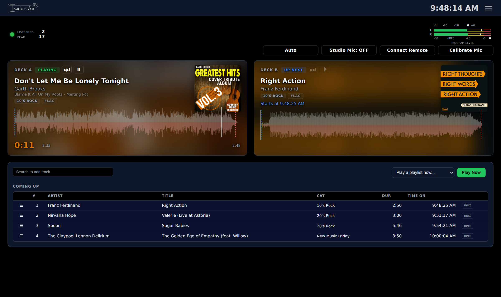
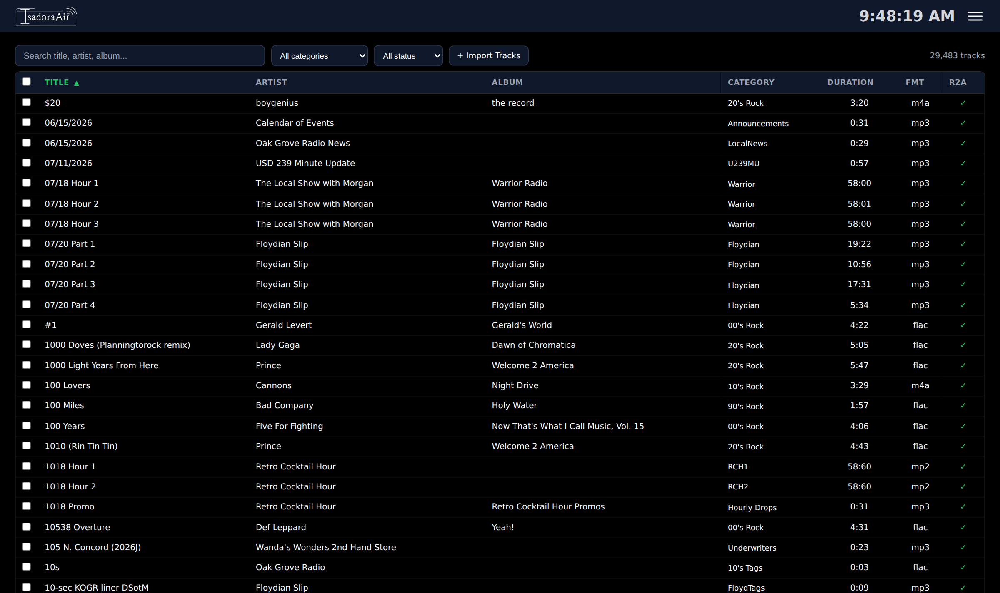

# IsadoraAir

Django-based radio automation system built for [Oak Grove Radio](https://oakgroveradio.com) (KOGR-LP, Minneapolis KS).

IsadoraAir manages the full music library, schedule programming, playlist generation, and live on-air playback for a broadcast radio station — from importing and analyzing a track to actually mixing it out through the studio monitor. At our station is has replaced NextKast OnAir + MagicRDS 4 on Win 11 + separate content ingestion scripts on a Ubuntu box with a Django application backed by PostgreSQL, plus a standalone GStreamer playback engine running on Ubuntu on a modest 8th Gen i7 and all of the horsepower of a proper database.

## Screenshots

**On-air console** — twin waveform decks with album art, VU meter, listener statistics, mic controls, FX Carts, and the coming-up queue.



**Library** — searchable/filterable/sortable, with bulk actions and an import + CD-rip page under the same roof. Runs comfortably at tens of thousands of tracks on modest hardware — the KOGR-LP production install pictured here holds ~30k rows, and the underlying Postgres + indexed queries scale well beyond that for anyone with a bigger collection.



## Features

**Library Management**
- Import audio files from disk or via drag-and-drop upload at `/library/import/`; automatic tag reading (ID3, Vorbis, MP4/AAC, and RIFF LIST INFO for WAV) via mutagen
- WAV / AIF / AIFF uploads are automatically transcoded to FLAC on their first analyze pass (same DB row, tags preserved, original file removed) so the library ends up single-format and tag-friendly
- CD ripping directly on the box (see the CD Ripping section below)
- Audio analysis: waveform generation, auto-detection of cue-in and next-start (mix) points via ffmpeg; per-category threshold overrides (dBFS for cue-in and next-start) let quiet material like classical music use later triggers than the global defaults
- Fast cue-point re-pick: analyze_tracks persists the mono envelope into the waveform JSON, so re-picking cue points after a threshold tweak (per-track "Reset Cue Points" button on `/track/<pk>/`, or per-category "Update Cue Points" on `/categories/`) runs in seconds instead of the minutes a full re-decode would take
- `fix_unknown_artists` management command: parses "Artist - Title" out of tracks whose artist is "Unknown Artist" and writes the split back to file metadata; WAV/AIF get transcoded to FLAC first (since they can't carry tags cleanly) with the original marked `ready2air=False` for manual weeding
- Related Artists: a per-track, comma-separated free-text field (editable on `/track/<pk>/`) naming other artists that should count as "the same artist" for rotation separation. A shared conservative parser auto-discovers feat./ft./featuring/with credits and bare "&"/"and" collaborations (only split when both resulting names already exist as Artist rows) from the artist/title fields and appends newly-found names — never replacing a manually entered value, even on forced reanalysis. The `autofill_related_artists` management command (dry-run by default, `--query`/`--category`/`--ready2air` filters) and a matching "Auto-fill Related Artists" button on `/library/` apply the same discovery across a whole filtered set of tracks in one pass
- Searchable/filterable frontend with full track detail editing; comfortably handles libraries in the tens of thousands of tracks on modest hardware (Postgres + indexed queries scale further for anyone with a bigger collection)
- Bulk actions: mark ready-to-air, assign categories, set metadata
- Per-track cue points, rotation weight, energy level, vocal type, end type, RBDS overrides
- Category Kind (Music/Imaging/Spot/Talk, extensible) with an admin-manageable fill color per kind, shown on the live dashboard's queue
- Album-art resolver with layered fallbacks: per-Album and per-Artist manual overrides, cached results, embedded artwork extracted from the audio file, an optional station-hosted `{artist-slug}.png` source, Deezer/iTunes lookup for music, and a UI Theme default image as the final fallback. The hosted base URL is configurable alongside Default album art in UI Theme; blank disables hosted lookup, and changing it selectively invalidates hosted/previously-unresolved cache rows so the new setting takes effect without a service restart

**CD Ripping** (built into `/library/import/`)
- Insert a CD, click "Detect CD" — libdiscid reads the disc, MusicBrainz supplies the album + track metadata, all fields land in an editable form so the operator can adjust before ripping
- Falls back to a blank editable table when MusicBrainz has no matching release (unknown discs / rare pressings still rippable, just with manual tag entry)
- Ripping itself is whipper (secure cdparanoia-based ripper) as a detached subprocess so a gunicorn worker restart doesn't kill an in-flight rip; per-job staging dir keeps concurrent probing safe
- AccurateRip verification is captured per track (match / nomatch / notfound badges on the Done screen); `require_accurate_rip` config gate lets non-verifying tracks land with a warning instead of being rejected outright — appropriate since many CD-Rs and older pressings aren't in the community reference database
- Live progress UI: subprocess stdout streams into `status_message` every second, terminal-state dispatcher rehydrates on browser refresh so a mid-rip page reload picks up where it left off
- Drive characteristics (device path, read offset, staging root, AR strictness) live in a `CDRipConfig` singleton editable at `/admin/library/cdripconfig/` — replacing the drive doesn't need a redeploy, just an offset lookup at accuraterip.com/driveoffsets.htm
- Each ripped track lands as `<Artist> - <Title> [Trk NN].flac` under `<library_root>/<category>/`, ready2air=False so it hits the same human-review gate as any other new import

**Schedule Programming**
- 7x24 schedule grid (responsive — day-view on mobile) assigning either a weighted Rotation or a fixed Playlist to each hour, recurring (day-of-week) or one-off (specific date)
- Rotations are ordered slots of Categories; Playlists are hand-built ordered track lists (drag-to-reorder builder UI)
- Holiday-themed rotation weighting with configurable ramp-in/ramp-out periods

**Log Builder**
- Generates each hour's playlist automatically from its ScheduleBlock (Rotation → Category → Track, or Playlist → PlaylistItem directly), auto-approved with no manual gate
- Recency avoidance with configurable artist/title separation windows (global defaults + per-category overrides), time-based or proportional-to-category-size
- End-of-hour landing uses matched-pair planning plus full-pool duration-aware exact fitting; scheduling and Coming Up projections share listener-facing effective-airtime semantics (cue-in adjusted), with clock-drift-aware targets and bounded asynchronous live backfill for genuine gaps
- Related-artist separation: a track's artist identity is its primary Artist plus every name in its Related Artists field, and two tracks are treated as the same artist for recency purposes whenever those identity sets overlap — so a solo cut and a feature/duet involving the same performer won't air back-to-back even when neither track's primary Artist field matches the other's. Applies everywhere ordinary artist separation does — recent-play history, same-hour picks, fixed rotation slots, playlist fills, and holiday injection pools — and to Web Request slot-eligibility checks
- Log Fill Configuration: tops a short hour up from a fallback category (repeat-last or fixed) so a short playlist/rotation never leaves the engine short

**Playback Engine** (`library/services/engine.py`, runs as its own `isadoraair-engine` service)
- Single GStreamer pipeline mixing two independent decks through a live `audiomixer`, with real crossfading timed off each track's analyzed cue-in/next-start points — not a scripted fade curve, the "fade" is each track's own mastered outro/intro
- Broadcast-clock hour handling: swaps to the next hour's log ~30s before top-of-hour rather than waiting for the current hour's queue to drain, so playback stays locked to wall-clock hours
- Pause/resume/eject/seek per deck, all live-controllable from the dashboard
- Interim AGC (compressor + makeup gain + limiter) for the studio monitor output specifically, configured from its `AudioOutput` admin page

**Live Studio Mic + PTT + Graceful Ducking**
- Dashboard "Studio Mic" button (click-to-toggle) gates a live studio mic input into the on-air mix via a two-mixer pipeline: the decks' summed output feeds a duck gain stage before joining the mic in a shared master mixer, so a track transition mid-talkover never causes a duck discontinuity
- Optional ducking (admin enable/disable + level in dB) smoothly ramps program audio down/up over ~500ms on PTT toggle — no clicks from an instantaneous level change
- Mic hardware controls (gain, preamp, etc.) are dynamically enumerated from the configured device's real ALSA mixer controls in admin — no hardcoded interface-specific fields, so it adapts to whatever's actually plugged in
- Optional stable ALSA card identity can be stored for the studio `AudioInput`; when configured, device loss is detected and the mic branch is rebuilt automatically when the interface returns even if its numeric ALSA card index changes. Legacy/raw-path rows keep the old no-auto-recovery behavior by default, and a recovered mic returns gated OFF

**Remote DJ over WebRTC**
- Browser-based remote DJ console at `/remote-dj/` — a remote DJ connects from any phone or laptop, hears program audio via a WebRTC monitor-return (mix-minus so they don't hear themselves), and can talk over via a gated remote mic that mixes into the on-air chain
- Server-side WebRTC via GStreamer's `webrtcbin` (media stays direct UDP; nginx only terminates the signaling websocket); STUN-only ICE with a pinned UDP port range for router forwarding, STUN DNS pre-warmed at engine start to shorten cellular first-connect
- Remote Mic PTT is surfaced through the shared dashboard/Remote DJ UI under the existing connection-ownership rules; while LIVE, the button fill acts as a real-time VU meter from authoritative engine level data and falls safely to empty on OFF, stale data, or disconnect. The same ducking config applies uniformly to whichever mic is live (studio local, remote, or both)
- Full queue authority for the connected DJ — search-to-add, Play Now, drag-to-reorder, per-row force-next — so they can run their own show start to finish; track-detail links are the only console feature intentionally kept out of remote_dj mode
- Login-gated on a dedicated `remote_dj` Django group with time-signed short-lived signaling tokens; anyone not in the group gets a minimal 'not authorized' page instead of the console

**Live Dashboard**
- Dual-deck view (stacks on mobile) with click-to-seek waveform, live position, and transport controls for whichever deck is playing; the idle deck previews the next queued track
- "Coming Up" queue table for the full remaining hour — drag-to-reorder (mouse and touch, same Pointer Events code path), insert a track by search, per-row "force next" button, color-coded by Category Kind
- Manual "play a playlist now" override, a "Restart Engine" recovery button, Studio Mic PTT, and a Remote Mic PTT whose LIVE-state fill doubles as a real-time mic VU meter
- Listener widget shows current listeners, peak listeners, and accumulated Total Listening Hours (TLH); TLH is integrated by the monitoring service and resets at a calendar-month boundary, with a manual reset endpoint for an operator-initiated cycle reset

**FX Carts / Hotkeys**
- Grid of one-shot audio buttons (drops, stingers, jingles, ID sweepers, sound effects) always visible on the main dashboard + remote-DJ console; first 8 in a compact row, "More…" expands the full grid. Mobile-portrait: collapsed behind a single "FX Carts (N) ▼" toggle with ~50% button size so the panel doesn't eat the deck view
- Each cart is a `FXCart` admin row (Config → FX Carts) with configurable name, audio file, per-cart gain trim, retrigger mode (Restart / Ignore / Stop for click-to-play/stop long beds), keyboard shortcut (single key; unique across all carts; focus-aware so typing into search doesn't fire them), and RGBA idle + playing colors via the same color+opacity picker UI Theme uses
- **Button IS the progress bar** — as the audio plays, the button's playing color sweeps left-to-right over the file's actual duration, then snaps back to idle. The browser reconciles that animation against authoritative active-fire state published by the engine, so fires started from another dashboard or an unattended source such as the weather alert bridge are reflected across consoles instead of existing only in the browser that initiated them
- File upload: drag-drop an audio file straight onto the cart admin change form; server places it under `/srv/isadoraair/carts/` and fills in the filepath field. Hard-coded paths still work — the two entry methods coexist. File-existence badge (green ● / red ⚠) in the admin list view catches "file was deleted but the row is still here" mistakes at a glance
- Audio path: persistent FX sub-mixer + single permanent pad on the master mixer — no pad churn on the main audio path, so a fire (or a spam of them) can never destabilize the on-air chain. A permanent silent source keeps the mixer / alsasink continuously hot so the first fire after idle doesn't lose its leading edge to a cold-start
- `FXBusConfig` singleton (Config → FX Bus): global bus volume (live-adjustable) + polyphony cap (max simultaneous fires; over-cap fires are dropped)

**Voice Tracking**
- Two DJ voice-overs per song — one for the outro (fires at the outgoing track's `outro_starts_seconds`) and one for the intro (fires before the incoming track's `intro_until_seconds`). Track-bound, so "That was Dolly Parton's 1978 hit…" is recorded once and plays every rotation of that song
- Browser recording via `MediaRecorder`, WebM/Opus captured client-side, transcoded to 16-bit PCM WAV in the browser (`audioBufferToWav`) and uploaded — no server-side ffmpeg dependency, works on any device with a mic. All three DSP passes (AGC, noise suppression, echo cancellation) are forced OFF via `{exact: false}` constraints so the raw take reaches the on-air chain untouched by Chrome's speech-optimized guessing
- In-browser audio editor with waveform display (mono / stereo aware L/R lanes), keep/delete trim modes with in-session undo stack, peak normalize (0.95 target), zoom on mousewheel + Alt-drag pan + click-to-seek. Destructive Save-and-close writes a fresh WAV via atomic tmpfile-then-rename, so a crash mid-write can't corrupt the airable file
- Playback engine sequencing: at outgoing outro_starts, the state machine enters VT mode, fires the outro-VT with a configurable duck ramp on the deck bus, plays outgoing to natural end, holds for outro-VT to finish, waits `min_gap_ms`, fires intro-VT, and computes an incoming-deck start delay so the intro-VT ends exactly at the incoming track's `intro_until_seconds` — with music underlap when needed. Dedicated `vt_duck_gain` element upstream of the mic duck so VT ducking and mic ducking can be tuned independently
- Gated on `intro_until_seconds` and `outro_starts_seconds` markers being set (per SoundExchange-adjacent design: no VT should ever land in a track's vocal window). Record buttons enable in real time as the operator types marker values and auto-save the track before opening the recording modal, so no "click Save first, wait, then record" ceremony
- `/voicetracks/` index page (staff + remote_dj) lists every VT with track / artist / position / duration / edit / delete; Track detail page (`/track/<id>/`) has an inline recording modal for intro + outro slots. `VoiceTrackConfig` singleton (Config → Voice Track Config) tunes the global duck depth, ramp, and inter-VT gap

**Aircheck Recording** (`aircheck/` app)
- Captures what actually went out over the air, on demand, from any dashboard — start/stop button, session list with duration + file size + status
- Backed by a persistent liquidsoap `output.file` block driven over telnet (`aircheck.reopen`), so no per-session ffmpeg subprocess is spawned and no ALSA device is contended with the encoders — the same in-process source that feeds Icecast/Shoutcast is what gets written to disk
- HE-AAC encodes are remuxed async on stop for compact archival (~1/10th the size of FLAC) without blocking the session state, so a "did I really air that ad?" question a week later is a browser click away

**Streaming Encoders** (`encoders/` app, `isadoraair-encoders` service)
- First-class Django-configured Liquidsoap relay to Icecast and Shoutcast (v1/v2) destinations, one child process per shared ALSA capture device fanning out to every enabled stream (MP3/AAC/Vorbis) on that device
- Provider presets for Live365 and Radio.co sit on top of the same generic Icecast/Shoutcast transports, adding provider-specific protocol/format/MP3-rate validation and destination-health handling without creating a separate streaming backend
- Centralized protocol/format/credential validation plus Liquidsoap preflight before a changed group is allowed to replace a healthy running child
- Candidate / accepted / Last Known Good lifecycle: a changed encoder group is health-qualified after launch, promoted only after proving healthy, and automatically rolled back to the persisted LKG configuration if qualification fails
- Runtime-affecting admin changes are detected by the running EncoderManager and reconciled per input-device group; only the affected Liquidsoap child is replaced, while unrelated encoder groups stay running. Desired/running/accepted configuration fingerprints and reconciliation outcomes are persisted for diagnostics
- Live now-playing metadata pushed to each stream from the playback engine
- Self-reported silence detection per feed (no second ALSA reader on the same device) surfaced to Monitoring

**RBDS/RDS Encoder Client** (`rbds/` app, `isadoraair-rbds` service)
- Sends conventional Program Service (PS) and RadioText (RT/RT+) to an RDS encoder in either binary UECP or StereoTool's ASCII dialect. PS can be Static, operator-managed Manual Frames, or Generated Rotating PS; generated mode supports deterministic rotation modes plus safe now-playing composition from station text, artist, and title
- UECP Long PS is separately manageable from conventional PS, with explicit unmanaged/disabled/enabled ownership and static or now-playing source text; Long PS is UECP-only
- UECP transport supports TCP and UDP; UDP sends one complete UECP frame per datagram for compatibility with embedded transmitter/encoder receivers
- Extended Country Code (ECC) transmitted via UECP's Slow Labelling Codes command (RDS group 1A, variant 0) so receivers can fully qualify the PI code's country instead of inferring it from the PI's leading nibble alone — UECP only, StereoTool's ASCII dialect has no ECC command
- Per-Category RBDS PTY (Program Type) override with an optional 8-character PTYN (Program Type Name) — lets a specific rotation category broadcast a different PTY than the station-wide default while its tracks are airing (e.g. a Sunday jazz block sending PTY=Jazz on top of an otherwise Rock station), configurable per category in Django admin or the `/categories/` frontend page; PTY override applies on both protocols, PTYN is UECP-only (no ASCII equivalent)
- Promo rotation with priority-interrupt scheduling that returns to now-playing once shown; each message can source its text from a static field, a local file, or a URL
- Read-only status dashboard; all configuration is admin-only

**System Monitoring** (`monitoring/` app, `isadoraair-monitoring` service)
- systemd/disk/CPU/memory/temperature/transmitter/audio-silence health checks, admin-configurable thresholds
- Email (and SMS-via-carrier-gateway) alerting with per-check debounce and cooldown
- Compact release/version-skew visibility compares the Git revision currently checked out with the revision each long-running IsadoraAir service captured at startup, distinguishing current, stale, indeterminate/dirty, and unknown runtime state without conflating deployment state with service health
- Transmitter integration (Aquabroadcast COBALT) for forward/reverse power, VSWR, PA temperature, fan speed, and RF interlock

**Reports** (`/reports/` frontend — Royalty Reporting + Hidden Track Detection + Listener Stats tabs)
- SoundExchange NCE Report of Use generator — per-unique-track spin counts with ISRC, album, marketing label, aggregate tuning hours, and a service-identifier header block. Music-category-kind plays only, 30-second SoundExchange threshold applied at query time. Also produces a human-readable summary format for eyeballing before submission, and a raw-CSV audit dump of every PlayEvent.
- Append-only `PlayEvent` evidence ledger — written by the playback engine at deck creation and closed out at deck removal. Snapshotted fields (title, artist, album, label, ISRC, category kind) are immutable once written so a downstream track rename or delete can't corrupt historical rows. Retention: 3 years by default (SoundExchange's typical audit lookback), auto-pruned by `isadoraair-prune-royalty-ledger.timer`.
- `Track.isrc` field auto-populated from ID3 TSRC / Vorbis ISRC tags at import; the `backfill_isrc` command re-reads existing library files; the `backfill_isrc_musicbrainz` command queries MusicBrainz for tracks with no tag ISRC using artist + title + album + duration matching (single-candidate confidence required unless `--allow-ambiguous` is passed).
- Aggregate Tuning Hours computed automatically from per-minute Icecast / Shoutcast listener samples (`isadoraair-sample-icecast.timer`) with irregular-sample handling and a one-hour outage cap. ATH is derived from `listeners_by_mount` and counts only streams owned by currently enabled IsadoraAir Encoder rows, so unrelated SIDs/mounts on a shared server cannot inflate the station's SoundExchange total. Manual override remains available for reconciliation against a stream host's own admin panel.
- Royalty tab: month picker, format selector, ATH-override input, and a table of past reports showing ATH, ISRC coverage, and one-click download. Persisted `RoyaltyReport` archive lives on disk forever with a metadata row for audit trail.
- Station identity for the NCE header row lives in a `StationInfo` admin singleton (Config → Station Info) — legal name, call letters, stream/program name. TuneIn credentials likewise in a `TuneInConfig` singleton (Config → TuneIn AIR). No `.env` editing required to change either.
- Listener Stats tab: date-range chart built from the same historical listener samples, with adaptive 15-minute / hourly / daily buckets, per-stream lines labeled from enabled Encoder rows, and an aggregate recomputed from station-owned streams only. Foreign or disabled streams on a shared Icecast/Shoutcast server are excluded rather than folded into the total.
- Hidden Track Detection tab: read-only diagnostic scan of already-persisted waveform envelopes (no audio re-decode) that flags likely CD-rip-style hidden tracks — an indexed song fading to silence, an unlisted gap, then a sustained hidden song resuming. Silence/gap/resumed-audio thresholds and duration/position minimums are operator-adjustable with sane defaults, plus optional ready-to-air/category/single-track filters. Large libraries are scanned in cursor-based AJAX batches so a full-library run stays safely under the Gunicorn request timeout. Never touches Track rows, cue points, or waveform/audio files — each suspect just links to its library detail page for manual review.

**Admin & Configuration**
- Django admin, organized into Library / Traffic / Config / Logs sections so unrelated models don't all pile into one bucket
- Analysis Configuration (cue-in/next-start dBFS thresholds), Recency Configuration, Log Fill Configuration, Remote DJ Configuration (STUN server, ICE UDP port range, gain)
- UI Theme: site-wide color palette and nav clock styling, editable with a native color+opacity picker, no page reload required; its Deck Overlay (album art) section also holds the Default album art and optional Hosted Album Art Base URL used by the resolver's station-level artwork fallback policy
- Admin-editable navigation menu (Config → Nav Menu): labels, target URLs (Django URL name or arbitrary URL), one level of dropdown children, drag-sort, per-item active-highlighting hints — no template edits needed to reshape the top nav
- Group-based access control: non-staff/superuser users are gated to the union of allowed paths for their Django groups, admin-editable via a `GroupAccess` model (Groups → access inline) — no code edit to grant a group a new URL prefix. Ships seeded with a `remote_dj` group (Remote DJ console + read-only library + track detail) and a `Contributor` group (library browse + upload their own tracks, no editing others'). Cached in-process and invalidated on save so an admin change takes effect on the very next request
- Station timezone (Config → Station Time): every displayed time on the site (dashboard clocks, schedule current-hour highlight, log timestamps, Coming Up ETAs) is pinned to the admin-selected IANA zone regardless of the viewer's device timezone. Applies to server-side render + client-side JS clocks alike, no restart
- EmailLog (Logs section): every outgoing email sent through Django's mail API — password resets, admin invites, monitoring alerts, anything — leaves a read-only row in the admin. Bodies truncated at 10k chars with a visible marker; auto-pruned after 90 days by a systemd timer (`isadoraair-prune-emaillog.timer`)
- Password-reset flow with "Forgot password?" on the login page + an admin-side invite button for creating no-password accounts and mailing them a setup link
- Selected operational `.env` settings are admin-editable without moving them into the database: SMTP transport settings under Monitoring → Notification Config; `LIBRARY_ROOT`, `WAVEFORMS_DIR`, and `MUSICBRAINZ_CONTACT` under CD Rip Configuration; `WEATHER_DATA_DIR` under Weather Config; and `REPORTS_ROOT` under Station Info. Writes are allowlisted and atomic, Saved-vs-Running state is shown explicitly, and restart-required changes leave an audit `SystemEvent`
- Notification Config includes SMTP transport diagnostics and an explicit Send Test Email action; recipients are validated before save and delivery failures are recorded without exposing SMTP secrets
- django-axes login lockout on repeated failed sign-ins

**Content Ingestion & Integrations**
- Syndicated program ingestion framework: any external audio program can be pulled from its source, tagged (with artwork where available), and delivered into a rotation category on its own broadcast schedule. Each show is a `syndicated-<slug>.timer`/`.service` pair paired with a small per-source fetcher script; the framework handles metadata, categorization, file placement, and the ready2air gate. Per-source fetchers live outside this repo since they typically carry feed URLs, credentials, or scraping logic specific to each provider. The KOGR-LP install runs 20+ syndicated shows through this framework
- Weather integration: NWS-sourced current temperature, one-day and three-day forecasts feeding RadioText messages via the RBDS client, plus an alert beep for active watches/warnings that fires as a regular `FXCart` (`WeatherConfig.alert_sound_cart`) through the playback engine's own FX sub-mixer — audible on the studio monitor and remote-DJ monitor-return, not just on air, at the cost of depending on the engine being up to fire at all
- Kansas road-conditions integration (`road_conditions` app): ingests KDOT/KanDrive CARS construction, closure, restriction, winter-driving, and weather-warning events into normalized `RoadEvent` rows with admin-configurable coverage filters; generates a consolidated spoken road report with the weather voice schedule/Kokoro path, optional inter-item transition audio, safe stale-feed retirement, and deterministic report fingerprinting so unchanged healthy reports skip unnecessary re-synthesis
- Bluesky auto-poster: now-playing metadata pushed to a configured Bluesky account every 2 minutes, with de-duplication so an unchanged track doesn't re-post
- TuneIn AIR now-playing pusher: hits TuneIn's broadcaster metadata API on every track change with one HTTP call per song start (respects their explicit "do not use a timer to submit a song" rule by deduping on PlayEvent id — the timer fires every 30s but only makes an outbound call when the current PlayEvent id differs from the last successful push). `commercial=true` set automatically for Spot-category plays. Credentials in Config → TuneIn AIR
- `ogremote` receiver: **ogremote is a separate newsgathering / voiceover tool that is not part of this project** — it runs on its own box and produces content to be aired. IsadoraAir ships only the receiving-side integration: polls for available uploads and dispatches urgent-replay drops into the library. Optional; disable the two `ogremote-*.timer` units if you're not running ogremote upstream
- Web song requests (`webrequests` app): **the request form itself lives on a separate public-facing website, not part of this project** — IsadoraAir ships the receiving-side integration a site like that talks to. Three pieces run on a timer against a small HTTP API (`/api/isadoraair/...`, key-authenticated): a 15-minute catalog sync pushes every ready2air music-kind track plus a 168-cell weekly availability grid so the site knows what's requestable and when; a ~20s poll pulls newly submitted requests (song + optional requester name/dedication message) and pushes back each request's live status with an ETA sourced from the running engine's actual queue, not the static build-time schedule. Lifecycle is `pending` / `no_slot_soon` → `scheduled` → `fulfilled` (plus terminal `expired` / `unavailable`) — `scheduled` means the track has been swapped in place into an open, recency-clear music slot (never inserted, so a request can never preempt an `insert_urgent` weather/AMBER alert or resize the hour); `fulfilled` is set only once the engine actually starts playing it, from the same real air-start event that drives recency/royalty logging. If an assigned slot gets swept away by an hour-boundary rollover before its turn, the request is automatically detected and requeued rather than left stuck — concurrency-safe against the engine's own last-second scheduling via row-level Postgres locking. Multiple requests for the same song collapse onto a single play, counted as one slot against the hourly cap regardless of how many listeners asked for it. Per-station config (master on/off, which hours accept requests, requests-per-hour cap, no-slot-soon lookahead, expiry) lives at `/web-request/` (staff-only) plus a matching `WebRequestConfig` admin singleton. External poller/sync scripts live outside this repo (`~/web-requests-ingest/`), same convention as weather-ingest/ogremote-ingest, since they carry the shared API key

## Architecture

```
IsadoraAir (Django 5.2 LTS)
├── isadoraair/                    # Django project settings + shared operational config
│   ├── env_config.py              # Allowlisted atomic .env read/write layer
│   ├── env_admin.py               # Shared Saved-vs-Running admin helpers
│   └── version_info.py            # Checkout/runtime Git revision identity
├── library/                       # Main library, scheduling, dashboard + playback app
│   ├── models.py                  # Track, Artist, Album, Category, Rotation, Playlist,
│   │                              # ScheduleBlock, PlaylistLog, UITheme, FXCart,
│   │                              # VoiceTrack, EmailLog, CDRipJob/CDRipConfig, etc.
│   ├── views.py                   # Page views + JSON API endpoints
│   ├── admin.py                   # Library/Traffic/Config/Logs admin sectioning
│   ├── cd_ripping.py              # libdiscid + MusicBrainz disc detection/rip helpers
│   ├── email_backend.py           # LoggingSMTPBackend — every send leaves an EmailLog row
│   ├── services/
│   │   ├── log_builder.py         # Playlist generation, fit/timing + scheduler diagnostics
│   │   ├── engine.py              # GStreamer playback engine (standalone process)
│   │   ├── audio_recovery.py      # Stable-device resolution + input recovery helpers
│   │   ├── related_artists.py     # Shared credit parser + artist-identity separation
│   │   └── remote_dj_signaling.py # WebRTC signaling websocket server (in-engine)
│   ├── management/commands/       # Import/analyze/CD rip/engine/maintenance commands
│   └── templates/library/         # Dashboard (shared with /remote-dj/), schedule,
│                                  # playlists, library, logs, track detail, reports
├── hardware/                      # AudioPipeline, AudioInput/AudioOutput, ducking,
│                                  # stable input identity, RemoteDJAudioInput
├── aircheck/                      # Program-bus Aircheck recording/session management
├── webrequests/                   # Public-site request sync, scheduling + dedication intros
├── ogremote/                      # Receiving-side ogremote integration
├── encoders/                      # Liquidsoap stream manager, provider presets + LKG rollback
├── monitoring/                    # System/service/transmitter/audio health, release skew
├── rbds/                          # UECP/ASCII RDS client, Dynamic PS + Long PS
├── weather/                       # Weather configuration + FX-Cart alert bridge
├── road_conditions/               # KDOT/KanDrive CARS ingest + spoken report generation
├── templates/
│   └── base.html                  # Dark-themed base template, mobile nav, live clock
├── deploy/                        # Reproducible deployment/recovery assets
│   ├── isadoraair-*.service/.timer # Core services + timer-driven jobs
│   ├── isadoraair.nginx           # nginx site config
│   ├── isadoraair-aloop.conf      # Pinned snd-aloop layout
│   ├── packages-ubuntu-26.04.txt  # Authoritative Ubuntu package manifest
│   ├── build_fdkaac.sh            # Pinned fdk-aac/fdkaac build
│   ├── check_he_aac.sh            # LC/HE/HEv2 capability validation
│   ├── backup_isadoraair.sh       # Repo-managed nightly backup implementation
│   └── restore/                   # Staged plan/apply bare-machine restore tooling
├── docs/                          # Runtime baseline, DR, ALSA/GStreamer/TTS provenance
└── legacy/                        # Original FastAPI prototype (reference only)
```

## Stack

- **Backend:** Django 5.2 LTS on Python 3.14, PostgreSQL 18, Gunicorn
- **Playback:** GStreamer 1.28.x (PyGObject) — standalone engine process, IPC with Django via JSON state/command files
- **Streaming:** Liquidsoap 2.4.x — standalone encoder manager relaying to Icecast/Shoutcast, including Live365/Radio.co provider presets
- **Hardware control:** ALSA (`amixer`/`arecord`/`aplay`) for device enumeration, stable identity resolution, and mixer control
- **Frontend:** Django templates, vanilla JavaScript (no framework)
- **Web Server:** nginx with HTTPS (self-signed cert for LAN; ordinary public TLS can be supplied by the operator)
- **Audio Analysis:** ffmpeg, mutagen
- **Supported runtime baseline:** Ubuntu 26.04 LTS; see [`docs/RUNTIME_BASELINE.md`](docs/RUNTIME_BASELINE.md) for the version/pinning policy

## Setup

Ubuntu 26.04 LTS is the supported and tested runtime baseline. Other
Debian/Ubuntu releases may work, but they are not part of the current
reproducibility/restore baseline. This walkthrough goes from a fresh box to
audible playback; [`deploy/packages-ubuntu-26.04.txt`](deploy/packages-ubuntu-26.04.txt)
is the authoritative package manifest for a full production/recovery install.

### 1. System packages

```bash
# Core runtime, build tools, database, web server, and Git
sudo apt install postgresql nginx git \
  python3 python3-venv python3-dev build-essential

# GStreamer playback + Remote DJ WebRTC. gstreamer1.0-nice is required
# by webrtcbin for ICE; gstreamer1.0-tools is used by deployment checks.
sudo apt install python3-gi gir1.2-gstreamer-1.0 gstreamer1.0-tools \
  gstreamer1.0-alsa gstreamer1.0-plugins-base gstreamer1.0-plugins-good \
  gstreamer1.0-plugins-bad gstreamer1.0-libav gstreamer1.0-nice

# Streaming encoders, ALSA utilities, and audio analysis
sudo apt install liquidsoap alsa-utils ffmpeg

# CD ripping toolchain -- optional if the box has no optical drive
sudo apt install whipper cdparanoia flac libdiscid0
```

`postgresql-contrib` and `libpq-dev` are not direct IsadoraAir requirements
on the supported baseline: the project uses the `psycopg2-binary` wheel and
no PostgreSQL contrib extension. Likewise, `gstreamer1.0-plugins-ugly` is
not in the current element inventory.

For HE-AAC/HE-AACv2 Aircheck and encoder capability, use the pinned
`deploy/build_fdkaac.sh` recipe and validate it with
`deploy/check_he_aac.sh`; do not substitute an unverified codec package.
The authoritative package manifest also defines optional groups for the
HE-AAC build toolchain, CD ripping, Kokoro TTS, encrypted recovery
credentials, and companion-project Selenium jobs.

### 2. ALSA loopback module (only if using StereoTool or a similar external processor)

IsadoraAir's engine can feed a virtual ALSA loopback device that
StereoTool reads from -- the "canonical digital mix out to processor,
processed audio back in" path. If you're not running an external
processor, skip this step and send the engine straight to your real
sound card.

**Two files are required, not just `modprobe snd-aloop`** -- the
default single auto-numbered loopback instance is not enough; the
studio config (`deploy/asound.conf`) and StereoTool's own configured
device both reference specific card indices, which only exist if
`snd-aloop` is told to create three instances at those exact indices:

```bash
# 1. Load the module at boot at all
echo snd-aloop | sudo tee /etc/modules-load.d/snd-aloop.conf

# 2. Pin it to three instances at fixed indices (see
# deploy/isadoraair-aloop.conf's own header comment for exactly which
# card each one is for and why the indices must be pinned, not
# auto-assigned)
sudo cp deploy/isadoraair-aloop.conf /etc/modprobe.d/isadoraair-aloop.conf

sudo modprobe snd-aloop
# Verify: `cat /proc/asound/cards` should show three "Loopback" entries
# at indices 0, 3, 4 alongside your real hardware.
```

### 3. PostgreSQL — create the database and user

```bash
sudo -u postgres psql <<'SQL'
CREATE USER isadoraair WITH PASSWORD 'change-me-in-.env';
CREATE DATABASE isadoraair OWNER isadoraair;
GRANT ALL PRIVILEGES ON DATABASE isadoraair TO isadoraair;
SQL
```

Whatever password you set here goes into `.env` in step 6.

### 4. Runtime directories

IsadoraAir writes to a few paths outside the repo. Create them with the
right ownership before the engine tries to use them:

```bash
sudo mkdir -p /srv/isadoraair/music /srv/isadoraair/waveforms
sudo mkdir -p /var/lib/isadoraair/weather /var/lib/isadoraair/reports
# Replace 'youruser' with whichever account will run the services
sudo chown -R youruser:youruser /srv/isadoraair /var/lib/isadoraair
```

Purposes:
- `/srv/isadoraair/music` — audio library root (matches `LIBRARY_ROOT`
  in `.env`).
- `/srv/isadoraair/waveforms` — pre-analyzed waveform JSON/envelope data
  used by the deck display and fast cue-point re-pick path (generated by
  `analyze_tracks` in step 9).
- `/var/lib/isadoraair/weather` — cached forecasts + alerts polled by
  the weather-ingest timer.
- `/var/lib/isadoraair/reports` — generated royalty / SoundExchange
  filings (persisted from the `/reports/` web page; overridable via
  the `REPORTS_ROOT` env var).

`/run/isadoraair/` (used for the engine's live state JSON) is created
automatically by the tmpfiles config in `deploy/` — no manual step
needed if you install the systemd units.

### 5. Clone + Python environment

```bash
git clone https://github.com/celltech161/IsadoraAir.git /opt/isadoraair
cd /opt/isadoraair

# --system-site-packages so PyGObject/gi (installed above as an OS
# package) is visible inside the venv
python3 -m venv venv --system-site-packages
source venv/bin/activate
pip install -r requirements.txt
```

### 6. Environment file

```bash
cp .env.example .env
```

Edit `.env` and set at least:

- `SECRET_KEY` — required in production (DEBUG=False will refuse to
  start without one). Generate a fresh key:
  ```bash
  python -c "from django.core.management.utils import get_random_secret_key; print(get_random_secret_key())"
  ```
- `DB_PASSWORD` — the password you set in step 3.
- `MUSICBRAINZ_CONTACT` — a real contact email for MusicBrainz requests
  if you use CD metadata or MusicBrainz ISRC backfill; replace the
  placeholder value from `.env.example`.
- `LIBRARY_ROOT` — the path where the music library lives (probably
  `/srv/isadoraair/music` from step 4).

After bootstrap, selected operational keys remain stored in this same `.env`
file but can be edited safely from Django admin: SMTP transport settings,
`LIBRARY_ROOT`, `WAVEFORMS_DIR`, `MUSICBRAINZ_CONTACT`,
`WEATHER_DATA_DIR`, and `REPORTS_ROOT`. Admin shows Saved-vs-Running state
and indicates which long-running services need a restart.

### 7. Database migrations + admin user

```bash
python manage.py migrate
python manage.py createsuperuser
```

### 8. Import your music library

Point `import_songs` at a directory tree of audio files. It walks
recursively, reads tags via mutagen, and populates the Track / Artist
/ Album / Category tables. Category is taken from the top-level folder
name under `LIBRARY_ROOT`:

```
/srv/isadoraair/music/
    Rock/
        Artist Name/
            Album Title/
                01 Track.mp3
    Country/
        ...
    Enhanced/        <- syndicated show category
        enhanced.flac
```

```bash
python manage.py import_songs /srv/isadoraair/music
python manage.py check_categories   # flags folders whose Category is not created yet
```

Categories need to exist in the DB before import — create them at
`/admin/library/category/` first, or run `check_categories` and it
will tell you which folders are missing.

### 9. Analyze tracks (waveforms, cue points)

```bash
python manage.py analyze_tracks
```

Generates waveform JSON (including persisted envelope/display data) and
automatically detects cue-in and next-start/mix points. Voice-tracking
intro/outro markers are operator metadata and are not fabricated by this
analysis pass. The analyzer runs periodically if you install the systemd
timer; the initial pass on a large library can take hours.

### 10. Run the web app and playback engine

For a first-run smoke test, run them in the foreground in two shells:

```bash
# Shell 1 — web UI on http://localhost:8000
python manage.py runserver 0.0.0.0:8000

# Shell 2 — the playback engine (this is what actually produces audio;
# runserver alone plays nothing)
python manage.py run_engine
```

Open `http://<your-box>:8000/`, log in as the superuser you created,
and follow the dashboard from there. The engine will start
auto-playing whatever is scheduled the moment you build a log.

### 11. Optional: streaming, RDS, monitoring

Each of these is a separate long-running process. None is required
for basic playback:

```bash
python manage.py run_encoders    # Icecast/Shoutcast relay
python manage.py run_rbds        # RDS text to the transmitter
python manage.py run_monitoring  # System + transmitter health checks
```

### 12. Production: systemd units + nginx

See [`deploy/README.md`](deploy/README.md) for the production install
conventions and placeholder rendering. The long-running components
(`isadoraair-gunicorn`, `isadoraair-engine`, `isadoraair-encoders`,
`isadoraair-rbds`, `isadoraair-monitoring`) each run as their own systemd
unit; timer-driven jobs are separate `.service`/`.timer` pairs.

The nightly backup implementation is now repo-managed at
`deploy/backup_isadoraair.sh` and is the source used by
`isadoraair-backup.service`. It captures PostgreSQL, the application/.env,
live configuration, and station content needed by the recovery procedure,
then uploads the completed archive off-box over SFTP with retention
handling. The remote-target credential file (`~/.iasboxbu.cred`) remains
host-local/external by design. Optional `age` encryption can preserve
additional companion-project recovery credentials inside the archive
without storing a private decryption key on the IsadoraAir host.

Bare-machine recovery tooling lives under `deploy/restore/`, with the
operator procedure in [`docs/DISASTER_RECOVERY_RESTORE.md`](docs/DISASTER_RECOVERY_RESTORE.md).
The tooling supports plan/staging/apply modes and has been staged against a
real backup; the actual clean-machine acceptance drill remains roadmap work.
For a full production bring-up, also run the read-only baseline preflight:

```bash
python manage.py check_deploy_baseline
```

Syndicated/weather/ogremote/web-request companion fetchers remain separate
projects when they carry provider-specific URLs, credentials, or scraping
logic. Their service templates can be rendered from `deploy/`, but their
code/venvs and secrets remain intentionally outside this repository.

## Running tests

```bash
PYTHONUNBUFFERED=1 python manage.py test
```

Always set `PYTHONUNBUFFERED=1` (equivalently, `python -u manage.py test`)
when a run's output is being redirected to a file or piped rather than
watched live in a terminal. Without it, Python fully buffers `stdout`
once it isn't attached to a terminal, while `unittest`'s own progress
dots and final `Ran N tests` / `OK` summary go to `stderr`, which
flushes immediately. Application code throughout this project uses
plain `print()` for operational logging, exercised extensively by the
test suite — with stdout buffered, all of that output queues up and
gets dumped in one block only when the process exits, landing *after*
the already-flushed summary in the captured log. On a large run, piping
through `tail -N` can then miss the summary entirely, making a fully
healthy, passing run look like a silent hang or crash with no
traceback. `PYTHONUNBUFFERED=1` keeps everything in true chronological
order instead.

Run a subset the normal Django way, e.g. `python manage.py test
webrequests` or `python manage.py test webrequests.tests.test_dedication_intros`.

## Migrating from NextKast, Rivendell, or another automation system

Some things worth knowing if you're coming from an existing station
running something else. This isn't an import tool — it's a
lay-of-the-land so you know what maps to what.

**Your existing music library moves with you.** IsadoraAir doesn't care
what created the audio files. Point `import_songs` at the directory
tree you already have; the mutagen-based tag reader handles MP3,
FLAC, WAV (both ID3 and RIFF LIST-INFO), M4A, Ogg, MP2, AIFF, and
ALAC. Category comes from the top-level folder name, so a Rivendell
`Group`-style organization already carries over if your folders are
grouped that way. If they're not, restructuring the folder tree is a
one-time `mv` operation before import.

**ISRC codes auto-populate from tags.** If your existing library
already has ISRC written into the ID3v2 TSRC or Vorbis ISRC frame,
`import_songs` picks them up and stores them for royalty reporting.
Whatever's missing can be filled in overnight by the MusicBrainz
backfill command (`backfill_isrc_musicbrainz`) — expect ~10% hit
rate on typical station music, more on well-catalogued genres.

**Rotations and Playlists are separate concepts** — this parallels
Rivendell's Clocks vs Log approach.
- A `Rotation` is an ordered list of category slots (or specific
  tracks) that the log builder walks to fill an hour. Category
  slots pick randomly from that category respecting recency
  separation, exactly like Rivendell's scheduler.
- A `Playlist` is a curated ordered list of specific tracks that
  the log builder copies verbatim, in order, no random picking.
- A `ScheduleBlock` maps either a Rotation or Playlist onto real
  time — recurring weekly patterns (day-of-week / hour) OR one-off
  overrides for a specific date.

**There's no separate workstation install per operator.** Everything
is web-based. Any operator with a browser and login credentials can
do anything they have permission for from anywhere — including live
DJ shifts via the WebRTC Remote DJ console. A NextKast admin
juggling three separate machine installs will find this a large
quality-of-life improvement.

**Audio quality is codec-discipline, not framework.** IsadoraAir uses
GStreamer where NextKast uses BASS and Rivendell uses libsndfile;
the audible result is the same when you avoid unnecessary format
conversions between decode and encode. Audio is normalized into the
configured `AudioPipeline.sample_rate` program domain (with float PCM at
the mixer stages), mixed once, and encoded once per destination — no
cascaded re-encoding.

**Commercial-style traffic (underwriting, affidavits, spot rotation)
is not part of the current implementation.** The existing "Traffic"
admin section is programming-side — Rotations, Playlists, and
ScheduleBlocks — rather than sponsor/campaign/affidavit management.

**No commercial license fee, no per-workstation seat.** IsadoraAir is
AGPLv3 — you can run it commercially, modify it, redistribute it.
The AGPL's network-service clause means if you host a modified
version as a public web service, that modified source has to be
available to the service's users. For an on-air station running an
unmodified copy internally, this changes nothing.

**Rough feature parity check** — most of what NextKast or Rivendell
does day-to-day is present:

| Feature | IsadoraAir |
|---|---|
| Multi-deck crossfade | Yes — dual-deck GStreamer mixer |
| Category/rotation scheduler | Yes — see Rotations above |
| Voice tracks | Yes — browser recorder, in-browser editor, engine state-machine handoff |
| Live assist / manual mode | Yes — dashboard override |
| Web request handling | Yes — public-site catalog sync + live queue fulfillment, see Content Ingestion & Integrations |
| Remote DJ | Yes — WebRTC, full queue authority, mix-minus monitor return, Remote Mic live VU |
| Icecast/Shoutcast streaming | Yes — Liquidsoap-based relay with Live365/Radio.co provider presets |
| RDS/RBDS to transmitter | Yes — UECP/ASCII client with Static/Manual/Generated PS, RT/RT+, and UECP Long PS |
| CD ripping | Yes — whipper + MusicBrainz metadata lookup |
| Waveform display + cue points | Yes — auto-analyzed on import |
| Multiple simultaneous encoders | Yes — first-class Encoder rows, grouped by input device into independently reconciled Liquidsoap children |
| Traffic (underwriting/affidavits) | No — current Traffic models are programming-side rotations/playlists/schedule blocks |
| EAS integration | Permanently external (hardware ENDEC upstream) |

**Note on the `deploy/` unit files:** paths and the run-as user are
`@@PLACEHOLDER@@` tokens (`@@ISA_USER@@`, `@@ISA_ROOT@@`, etc). See
[`deploy/README.md`](deploy/README.md) for the full placeholder table
and a copy-pastable install snippet that renders + drops each unit
into `/etc/systemd/system/`. Six variables cover the whole set;
`ISA_USER` and `ISA_ROOT` are the only two that matter for a
minimal install without the syndicated-ingest / weather-ingest /
ogremote-ingest / web-requests-ingest companion projects.

## Project Status

| Phase | Status |
|-------|--------|
| 1. Django models | Complete |
| 2. Library import & analysis | Complete |
| 3. Log builder | Complete — matched-pair/full-pool exact-fit landing, cue-in-adjusted effective airtime, clock-drift-aware targets, bounded async live backfill |
| 4. Playback engine | Complete — dual-deck GStreamer mixer, real crossfading, broadcast-clock hour handling, studio-monitor AGC |
| 5. Live dashboard | Complete — dual-deck view, full-hour queue with drag-reorder + force-next, click-to-seek waveform, manual overrides, Remote Mic live VU fill |
| 6. Streaming, RDS & monitoring | Complete — reconciled/LKG-protected Icecast/Shoutcast relay with Live365/Radio.co presets; UECP/ASCII RDS with Dynamic/Long PS; system/transmitter checks, alerting, and runtime-version-skew visibility |
| 7. Studio mic + ducking | Complete — dashboard PTT, dynamically-enumerated mixer controls, graceful ducking, optional stable-identity USB input hotplug recovery |
| 8. Content ingestion | Complete — 20+ syndicated shows on real schedules, weather data + alerts, Bluesky auto-poster, TuneIn AIR now-playing push |
| 9. Remote DJ over WebRTC | Complete — browser-based remote console, mix-minus monitor return, gated remote mic with live VU fill, full queue authority for the connected DJ |
| 10. Email + admin infrastructure | Complete — EmailLog transport capture, invite/reset flows, SMTP diagnostics/test send, admin-managed selected `.env` keys, editable nav menu, django-axes lockout |
| 11. Royalty reporting | Complete — PlayEvent evidence ledger, SoundExchange NCE / summary / raw-CSV generators, /reports/ frontend with Listener Stats, ISRC auto-populate from tags + MusicBrainz backfill, owned-stream ATH computation with manual override, 3-year retention prune |
| 12. FX carts / hotkeys | Complete — one-shot buttons with drag-drop file upload, RGBA colors, per-cart retrigger modes (restart/ignore/stop), keyboard shortcuts, mobile-collapsible panel, authoritative engine-synced progress state, persistent FX sub-mixer with one permanent pad on the master mixer and always-on silence to keep the audio path hot |
| 13. Voice tracking | Complete — per-track intro + outro VT slots, browser recording with DSP forced off, in-browser waveform editor with keep/delete trim + peak normalize + undo, engine state machine sequences outro-VT → gap → intro-VT with computed underlap-delay so intro-VT ends exactly at incoming intro_until, dedicated vt_duck_gain in the pipeline, auto-resume on engine restart preserves position |
| 14. Web song requests | Complete — public-site catalog/availability sync, request polling + live status/ETA push, in-place recency-aware queue fulfillment that can't preempt urgent alerts or resize the hour |
| 15. Road conditions | Complete — KDOT/KanDrive CARS ingest with configurable coverage, normalized event storage, spoken consolidated report generation, stale-feed retirement, and unchanged-report fingerprint skipping |

Actively running end-to-end on a live station: schedule → log builder → playback engine → StereoTool → transmitter, plus live streaming, RDS, monitoring, remote DJ, and content ingestion.

## Roadmap and current scope

The active roadmap is an unfinished-work punchlist: completed items are
removed rather than retained as checked entries. The bucket descriptions and
current item titles are listed here without implementation detail.

### Bucket 1 — Release hardening

Reliability, correctness, recovery, and runtime-baseline work that should be
settled before adding more architectural surface area.

- Disaster-recovery audit + bare-machine restore proof
- Automatic recovery when a USB audio output device disappears and returns
- GStreamer 1.28.6 upgrade and regression validation
- Remote DJ connection-establishment investigation and hardening
- Playback/accounting semantics audit — make “played” mean the event we actually intend
- Operational guardrails and observability follow-up

### Bucket 2 — Built features needing their next layer

Subsystems that already exist and work, but still need the next planned
layer rather than a rewrite.

- Scheduled Aircheck recording tied to `/schedule/` program blocks
- HE-AAC native dependency packaging for fresh installs and recovery
- Shared generated-speech / automated-announcement foundation + Weather Suite integration (staged)
- Granular talent roles, capabilities, and scheduled access
- Log-position voice tracking + remote talent job workflow
- Native managed syndicated / recurring program-content ingestion
- Advanced music scheduling rules + category-health / rule-break diagnostics
- Full-day log editor + programmer diagnostics
- Overlay sweeper engine using existing cue points and hardened audio buses

### Bucket 3 — Independent feature additions

New capability that can be developed in discrete passes once its prerequisite
architecture is stable.

- Multiple `/schedule/` profiles
- Portable configuration snapshots/export for schedules, rotations, playlists, and other station config
- Interactive fresh-machine IsadoraAir installer
- NCE-friendly underwriting / traffic / PSA scheduling + reconciliation
- General action / trigger / automation framework
- Generalized LiveSource / satellite / network-program input
- External mixer integration mode
- Studio ↔ Remote DJ IFB / intercom / talkback bus
- Scheduled recorder / time-shift recorder for external and live sources
- Special-event / sports / variable-duration program override scheduler
- Separate terrestrial/on-air vs streaming replacement content
- External music-scheduler log import / playout handoff
- Library bulk-select and bulk metadata editing
- Audio-processing topology modes for StereoTool and non-StereoTool installs
- Dedicated STL / contribution transport outputs
- Authoritative PAD / Now-Next / station-state event distribution API
- Automated podcast / RSS feed publishing from Airchecks and program assets
- Two-node hot-standby / emergency playout architecture
- Community TV / Video Engine module

## Security

For security concerns, see [SECURITY.md](SECURITY.md). Please report privately rather than opening a public issue.

## Support & Community

Ground rules for the GitHub side of this project — please read before opening an issue.

**Issues are for bona fide code defects only.** Reproducible bugs, crashes, factual errors in documentation, and security concerns (report those privately — see above) are on-topic. A minimal reproduction, the exact command that failed, and the full traceback / log line are what turn a report into something actionable.

**Support requests, "how do I set this up," "what's the right config for my station," and general help-me questions will be closed.** IsadoraAir is a working piece of software published for others to learn from, adapt, and run themselves — it is not a supported product. The code is open, the README is thorough, the Django / GStreamer / Liquidsoap / nginx upstream docs are excellent, and reading them is the expected first step.

**There is no official Discord, Slack, IRC channel, subreddit, mailing list, or forum for IsadoraAir.** If one appears, it is unaffiliated with this project; nothing said there is guidance from the maintainer, and no advice found there should be treated as authoritative.

**Response times are best-effort, as time permits.** This project is maintained around actually running a radio station; issues and pull requests are looked at when there's time between transmitter maintenance, on-air work, and everything else a small station requires. Silence on an issue is not disinterest, but it is also not a promise of eventual reply. If you rely on IsadoraAir in production, plan to be able to read and patch the code yourself.

**Pull requests are welcome and are the fastest path to seeing a change land.** A PR with a working patch (and, where relevant, a note on how you tested it) will get looked at before a feature-request issue with no code. Small, focused PRs land faster than large sweeping ones.

## License

Licensed under the **GNU Affero General Public License v3.0** — see [LICENSE](LICENSE) for the full text.

The AGPL is a strong copyleft. In short: you can use, modify, and redistribute this software (including for commercial purposes), but any modified version you run as a network-accessible service must have its source publicly available to the users of that service. That fits the community-broadcast ethos of this project — a broadcast automation stack that stays open even when it's deployed as a station's operational tool.
